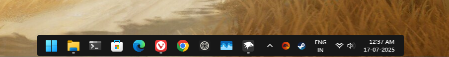

# CombinedDock
Windhawk taskbar theme



## Suggested Windows settings
* Hide Widget Button
* Pin atleast 5+ apps in taskbar

## Manual installation

The theme styles can also be imported manually. To do that, follow these steps:

* Open the Windows 11 Taskbar Styler mod in Windhawk.
* Go to the "Advanced" tab.
* Copy the content below to the text box under "Mod settings" and click "Save".

<details>
<summary>Content to import (click to expand)</summary>

```json
{
  "controlStyles[0].target": "Taskbar.TaskbarFrame",
  "controlStyles[0].styles[0]": "Width=Auto",
  "controlStyles[0].styles[1]": "HorizontalAlignment=Right",
  "controlStyles[0].styles[2]": "Margin=0,0,0,0",
  "controlStyles[0].styles[3]": "Transform3D:=<CompositeTransform3D TranslateX=\"-860\"/>",
  "controlStyles[1].target": "Taskbar.TaskbarFrame > Grid#RootGrid",
  "controlStyles[1].styles[0]": "Background:=<AcrylicBrush TintColor=\"{ThemeResource SystemChromeAltHighColor}\" TintOpacity=\"0.8\" FallbackColor=\"{ThemeResource SystemChromeLowColor}\" />",
  "controlStyles[1].styles[1]": "Padding=6,0,6,0",
  "controlStyles[1].styles[2]": "CornerRadius=3,0,0,3",
  "controlStyles[1].styles[3]": "BorderBrush:=<SolidColorBrush Color=\"{ThemeResource SurfaceStrokeColorDefault}\" />",
  "controlStyles[1].styles[4]": "Margin=0,1,0,4",
  "controlStyles[2].target": "Taskbar.TaskbarFrame > Grid#RootGrid > Taskbar.TaskbarBackground > Grid > Rectangle#BackgroundFill",
  "controlStyles[2].styles[0]": "Visibility=Collapsed",
  "controlStyles[3].target": "Rectangle#BackgroundStroke",
  "controlStyles[3].styles[0]": "Visibility=Collapsed",
  "controlStyles[4].target": "Taskbar.AugmentedEntryPointButton#AugmentedEntryPointButton > Taskbar.TaskListButtonPanel#ExperienceToggleButtonRootPanel",
  "controlStyles[4].styles[0]": "Margin=0",
  "controlStyles[5].target": "Grid#SystemTrayFrameGrid",
  "controlStyles[5].styles[0]": "Background:=<AcrylicBrush TintColor=\"{ThemeResource SystemChromeAltHighColor}\" TintOpacity=\"0.8\" FallbackColor=\"{ThemeResource SystemChromeLowColor}\" />",
  "controlStyles[5].styles[1]": "Margin=-4,-11,-4,-8",
  "controlStyles[5].styles[2]": "CornerRadius=0,10,10,0",
  "controlStyles[5].styles[3]": "BorderThickness=12,12,12,12",
  "controlStyles[5].styles[4]": "BackgroundSizing=InnerBorderEdge",
  "controlStyles[6].target": "SystemTray.ChevronIconView",
  "controlStyles[6].styles[0]": "Padding=0",
  "controlStyles[7].target": "SystemTray.NotifyIconView#NotifyItemIcon",
  "controlStyles[7].styles[0]": "Padding=0",
  "controlStyles[8].target": "SystemTray.OmniButton",
  "controlStyles[8].styles[0]": "Padding=0",
  "controlStyles[9].target": "SystemTray.CopilotIcon",
  "controlStyles[9].styles[0]": "Padding=0",
  "controlStyles[10].target": "SystemTray.OmniButton#NotificationCenterButton > Grid > ContentPresenter > ItemsPresenter > StackPanel > ContentPresenter > systemtray:IconView#SystemTrayIcon > Grid",
  "controlStyles[10].styles[0]": "Padding=4,0,4,0",
  "controlStyles[11].target": "SystemTray.IconView#SystemTrayIcon > Grid#ContainerGrid > ContentPresenter#ContentPresenter > Grid#ContentGrid > SystemTray.TextIconContent > Grid#ContainerGrid",
  "controlStyles[11].styles[0]": "Padding=0",
  "controlStyles[12].target": "SystemTray.StackListView#IconStack > ItemsPresenter > StackPanel > ContentPresenter > SystemTray.IconView#SystemTrayIcon",
  "controlStyles[12].styles[0]": "Padding=0",
  "controlStyles[13].target": "SystemTray.Stack#ShowDesktopStack",
  "controlStyles[13].styles[0]": "Margin=0,-4,0,-4",
  "controlStyles[14].target": "Taskbar.Gripper#GripperControl",
  "controlStyles[14].styles[0]": "Width=Auto",
  "controlStyles[14].styles[1]": "MinWidth=24",
  "controlStyles[15].target": "SystemTray.SystemTrayFrame",
  "controlStyles[15].styles[0]": "HorizontalAlignment=Left",
  "controlStyles[15].styles[1]": "Transform3D:=<CompositeTransform3D TranslateX=\"1054.5\"/>",
  "controlStyles[15].styles[2]": "Width=Auto",
"controlStyles[15].styles[3]": "Margin=-3,-4,0,-4"
}
```
</details>
